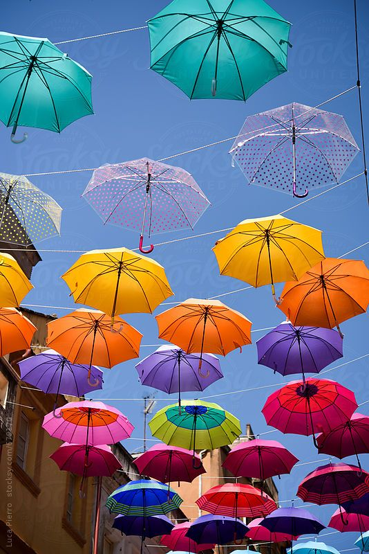
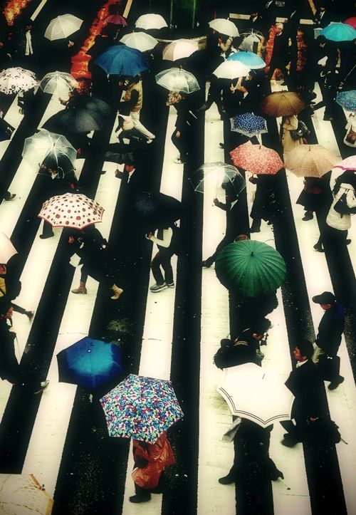

# Zhihao Wang_zwan0215_IDEA9103
### This is functioning prototype

# How to interact with the work:
1. **Load page:** When you open the artwork page, the canvas will automatically load and display a background pattern. The background consists of randomly generated circular patterns.
2. **Mouse interaction:Play** Click on the play button and the music will play immediately and the graphics will change shape and position according to the music.
3. **Mouse interaction:Pause** By clicking the Pause button, the music will stop immediately and the graphics on the screen will stop changing.

# Details of my individual approach to animating the group code
1. **Personal Code:** 

I chose “audio” interactions to drive my personal code. In detail this means that elements such as circles and polygons change dynamically as the tempo of the audio changes.

2. **How to animate:**

Color change: Each layer of the graphic is a randomly generated gradient color that changes with the tempo of the audio.

Size changes: each layer of the graphic is dynamically scaled with the amplitude of the audio. scaleFactor controls the scale of the graphic.

The change in size of the graphic is achieved by successive adjustments of the size property, while the change in color is achieved by the generation of gradient colors and random colors. This combination makes the appearance of the graphic dynamic in both size and color.

3. **Inspiration:**
I was inspired by this vimeo video. On top of that, I was also inspired by these photos. I wanted the style of the umbrellas to keep changing and appear randomly in the picture.

Umbrellas dancing up and down  [Video]. Vimeo. https://vimeo.com/49104159

4. **Technical Explanation of Image Animation:**

By following these steps and methods, the code achieves dynamic circle animations, along with interactive features.